# Helios Hand Controller (HC) — Codebase Architecture & Flow Guide

**Audience:** Engineers who have never seen this repository.  
**Firmware version:** `0.0.3` (`src/single_hand_controller/include/definitions/version.h`)  
**Authoritative pin map:** `src/single_hand_controller/include/definitions/IO_defs.h` (prefer this over older SRS extracts if they disagree)  
**Last aligned to code:** September 2026

---

## Table of contents

1. [What this project is](#1-what-this-project-is)
2. [Big picture — how the system fits together](#2-big-picture--how-the-system-fits-together)
3. [Repository map — what lives where](#3-repository-map--what-lives-where)
4. [Module responsibilities — which file does what](#4-module-responsibilities--which-file-does-what)
5. [Firmware lifecycle (boot → wakeup → OFP)](#5-firmware-lifecycle-boot--wakeup--ofp)
6. [The request pattern (how every operator action works)](#6-the-request-pattern-how-every-operator-action-works)
7. [End-to-end flows by HC functionality](#7-end-to-end-flows-by-hc-functionality)
8. [MAVLink message catalog](#8-mavlink-message-catalog)
9. [Physical controls → pins → code](#9-physical-controls--pins--code)
10. [Display / HMI](#10-display--hmi)
11. [Configuration & compile modes](#11-configuration--compile-modes)
12. [Error codes](#12-error-codes)
13. [How to navigate the code as a newcomer](#13-how-to-navigate-the-code-as-a-newcomer)
14. [Related docs](#14-related-docs)

---

## 1. What this project is

This repository is **embedded firmware** for the **Single Hand Controller (HC)** used on the **Scout TD0** UGV in **Mode A** (proximal remote teleoperation, typically within ~10 m).

| Term | Meaning |
|------|---------|
| **HC / Helios-HC** | Hand Controller — the physical remote the operator holds |
| **Scout TD0** | The unmanned ground vehicle (UGV) platform |
| **Mode A** | Close-range teleop mode that this HC supports |
| **Atlas (MC)** | Mission computer on the UGV; HC’s MAVLink peer |
| **OFP** | Operational Flight Program — the 20 ms control loop while connected |
| **RFD / UHF** | Radio link (e.g. RFD900x) between HC Mega and Scout |

**It is not** a web app, cloud service, or multi-process backend. There are no HTTP APIs, databases, or message queues. Everything runs on one **Arduino Mega 2560** in `setup()` / `loop()`.

**What the operator can do with this firmware:**

- Drive Scout with the joystick (when armed)
- Arm / disarm
- Change drive mode and speed limit
- Control lights
- Engage / clear remote e-stop
- See connectivity, RSSI, UGV battery, HC battery, and errors on the TFT

---

## 2. Big picture — how the system fits together

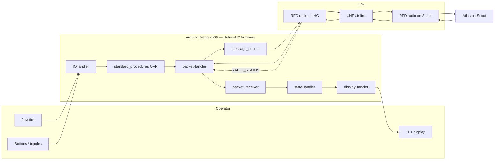

### Production vs lab link

| Mode | How MAVLink travels | Config |
|------|---------------------|--------|
| **Production** | Mega **Serial3** → HC RFD → RF → Scout RFD → Atlas | `RELEASE` on, `HC_LINK_OVER_USB` off |
| **Lab / USB** | Mega **USB Serial** directly to Atlas (no radio) | `HC_LINK_OVER_USB` on |

Only file to switch: `src/single_hand_controller/include/definitions.h` (see [§11](#11-configuration--compile-modes)).

---

## 3. Repository map — what lives where

```
scout-td0-HC/
├── README.md                          # Clone → build → flash → verify
├── flash_code.sh / import_build.sh /  # Flash & hex helpers
│   check_version_change.sh
├── Build/                             # Prebuilt .hex artifacts
├── docs/                              # Architecture / SRS / link notes
│   └── HC_CODEBASE_ARCHITECTURE_GUIDE.md   ← this file
└── src/
    ├── readme.md                      # Contributor how-to (add modes, MAVLink, IO)
    ├── error_handling.md              # On-screen error meanings
    ├── ugvcustom.xml                  # MAVLink dialect ICD source
    ├── Doxyfile                       # Doxygen config
    └── single_hand_controller/        # ★ Arduino sketch root
        ├── single_hand_controller.ino # Entry: setup() / loop()
        ├── *.cpp                      # Application modules
        ├── include/                   # Headers + definitions + MAVLink
        ├── libraries/TFT_22_ILI9225/  # Display library (must stay next to .ino)
        └── arduino/                   # Vendored AVR toolchain (mostly Linux)
```

**Sketch path (open this in Arduino IDE):**  
`src/single_hand_controller/single_hand_controller.ino`

**Sketchbook location must be:**  
`…/src/single_hand_controller` (so `libraries/` resolves).

---

## 4. Module responsibilities — which file does what

Think of the firmware as layers. Data always moves **operator → IO flags → OFP → MAVLink TX**, and **MAVLink RX → packet_receiver → stateHandler → display**.

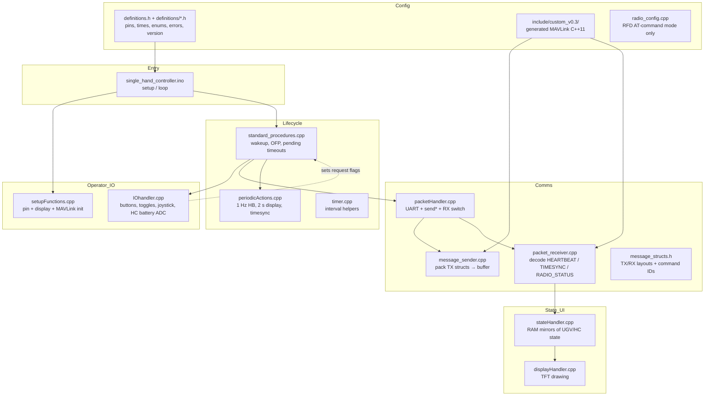

| File | Responsibility |
|------|----------------|
| `single_hand_controller.ino` | Boot once; decide wakeup vs OFP; special compile modes |
| `standard_procedures.cpp` | Connectivity, timesync, **OFP cycle**, pending-request timeouts |
| `IOhandler.cpp` | Poll GPIO; set `arm_press`, `switchMode`, `estop_toggled`, etc. |
| `stateHandler.cpp` | Own all mutable state (UGV armed, speed, drive mode, e-stop, lights, connectivity) |
| `displayHandler.cpp` | Draw TFT (status, RSSI, batteries, errors, info text) |
| `packetHandler.cpp` | Open `RADIO_PORT`, `sendBuffer`, all `send*()` APIs, `handlePacketReceived()` |
| `message_sender.cpp` | Fill ICD structs and pack MAVLink into `buf[]` |
| `packet_receiver.cpp` | Interpret RX messages; update state / signing clock / RSSI |
| `message_structs.h` | Structs and command IDs shared by sender/receiver |
| `periodicActions.cpp` | Linked list of “call this every N ms” actions |
| `setupFunctions.cpp` | `setupIO()`, `setupDisplay()`, `initMAVLink()` |
| `radio_config.cpp` | Only when `GET_RADIO_CONFIG` — configure RFD via `+++` AT commands |
| `include/definitions.h` | Master compile switches (release, USB link, signing, ICD params) |
| `include/definitions/IO_defs.h` | Pin numbers, joystick deadzone, battery ADC |
| `include/definitions/time_defs.h` | OFP 20 ms, heartbeat timeout 3 s, e-stop retransmit 1 s, etc. |
| `include/includes.h` | Central include graph for the sketch |

---

## 5. Firmware lifecycle (boot → wakeup → OFP)

### 5.1 High-level state machine

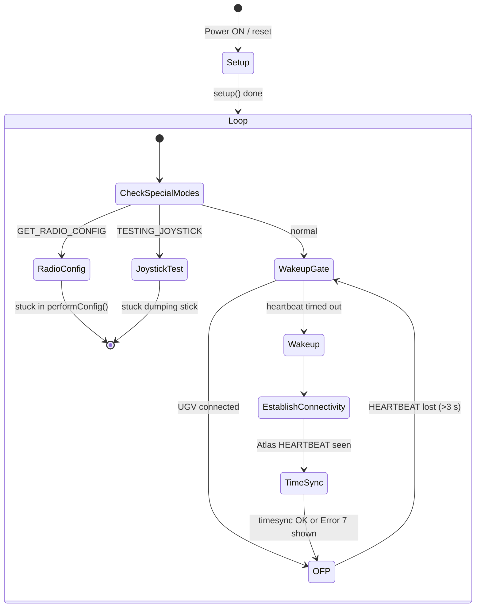

### 5.2 `setup()` — what runs once

**File:** `single_hand_controller.ino`

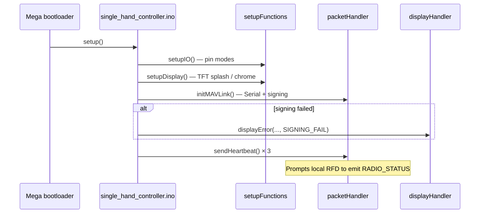

### 5.3 `loop()` → wakeup → OFP

**Files:** `single_hand_controller.ino`, `standard_procedures.cpp`

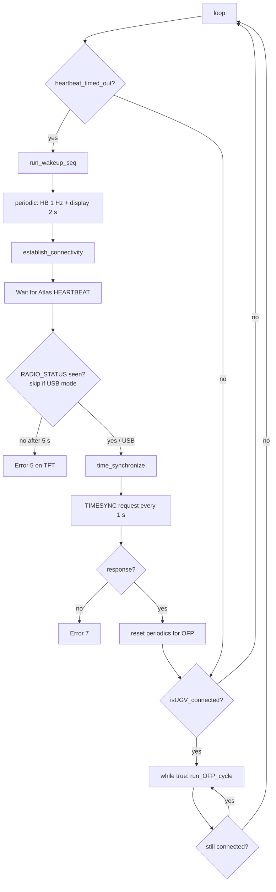

### 5.4 One OFP cycle (20 ms) — the heart of teleop

**File:** `standard_procedures.cpp` → `run_OFP_cycle()`  
**Period:** `OFP_LOOP_TIME` = **20 ms** (`time_defs.h`)

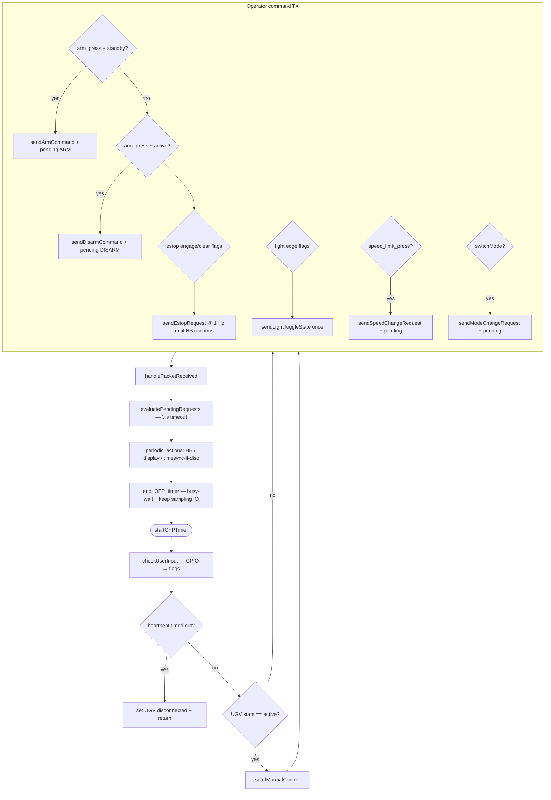

**Pin → OFP mapping (current firmware):**

| Pin | Control | OFP flag / action |
|-----|---------|-------------------|
| A0 / A1 | Joystick | `sendManualControl` when armed |
| 2 | Arm button (long-press) | `arm_press` → ARM or DISARM |
| 3 | Speed limit (hold 3 s) | `speed_limit_press` → cycle Low→Mid→High |
| 4 / 5 | E-stop 3-pos toggle | `estop_toggled` / `estop_clear_request` |
| 6 / 8 | Lights 3-pos toggle | `turnOffLight` / `turnOnHeadlight` / `turnOnFoglight` |
| 7 | Drive mode | `switchMode` |

---

## 6. The request pattern (how every operator action works)

Almost every state change follows the same design (documented in `src/readme.md`):

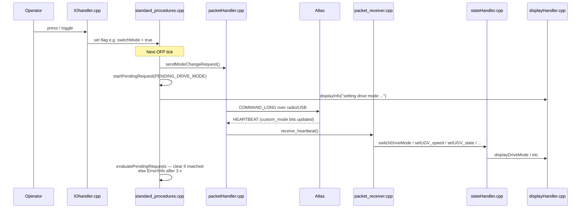

**Why HEARTBEAT instead of COMMAND_ACK?**  
Current production confirmation path uses Atlas **HEARTBEAT `custom_mode` bitfields**. Pending requests time out at **3 seconds** (`STATE_REQUEST_TIMEOUT_MS`) and show Error 3 (arm) or info text (speed / drive mode).

**Flags live in** `standard_procedures.cpp` and are declared `extern` in `IOhandler.cpp`.

---

## 7. End-to-end flows by HC functionality

Each subsection is independent: you can read only the feature you care about.

---

### 7.1 Connectivity, radio health, and timesync

**Purpose:** Know Scout is reachable, radio is healthy, clocks align (needed for MAVLink signing).

**Key files:** `standard_procedures.cpp`, `packet_receiver.cpp`, `packetHandler.cpp`, `stateHandler.cpp`, `displayHandler.cpp`

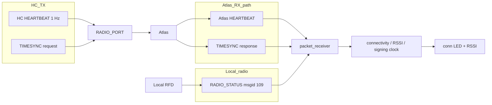

| Step | What happens | Where |
|------|----------------|-------|
| 1 | HC sends HEARTBEAT every 1 s | `sendHeartbeat` via `periodicActions` |
| 2 | Local RFD injects `RADIO_STATUS` | `receive_radio_status` — RSSI, txbuf; Error 5/6 |
| 3 | Atlas HEARTBEAT within 3 s | Clears timeout; `last_heartbeat_received_at` |
| 4 | HC sends TIMESYNC; waits for reply | `time_synchronize`; seeds signing timestamp |
| 5 | Loss of HEARTBEAT > 3 s | UGV → `disconnected`; leave OFP; re-wakeup |

**Connectivity LED** (`enum_defs.h` / `displayHandler.cpp`):

| Status | Colour | Meaning |
|--------|--------|---------|
| `all_disconnected` / radio-only | Red | No UGV |
| `low_connectivity` | Yellow | Connected but weak RSSI |
| `connected` | Green | Healthy |
| `comm_fault` | Blue | Timesync fault |

**USB mode:** Error 5 (no `RADIO_STATUS`) is skipped (`RADIO_SIMULATION_TESTING`).

---

### 7.2 Manual teleoperation (joystick → drive)

**Purpose:** While armed (`ugv_status == active`), send stick axes to Atlas.

**Key files:** `IOhandler.cpp` (`getXY`), `packetHandler.cpp` (`sendManualControl`), `message_sender.cpp`, `standard_procedures.cpp`

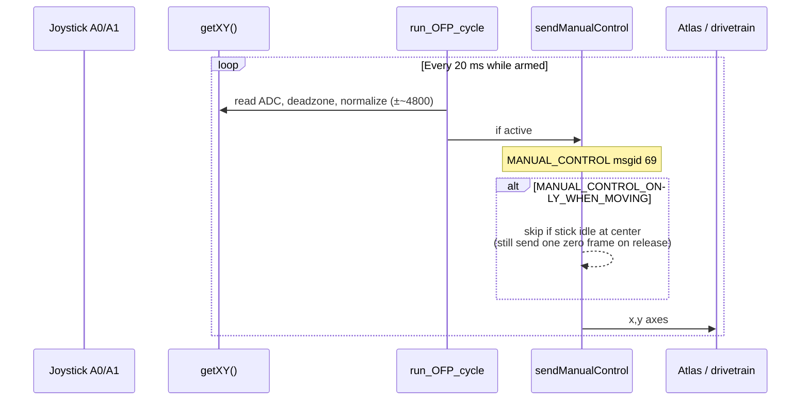

| Detail | Value / location |
|--------|------------------|
| Pins | A0 = X, A1 = Y (`IO_defs.h`) |
| Deadzone | `XY_LOWER_LIMIT` / `XY_UPPER_LIMIT` around mid ADC |
| Message | `MANUAL_CONTROL` (69) → Scout system ID |
| Gate | Only when `getUGV_state() == active` |
| Rate | OFP 20 ms (~50 Hz); optionally only when moving |

---

### 7.3 Arm / Disarm

**Purpose:** Enable or disable teleop authority on Scout.

**Key files:** `IOhandler.cpp` (long-press on pin 2), `standard_procedures.cpp`, `packetHandler.cpp`, `packet_receiver.cpp`, `message_structs.h`

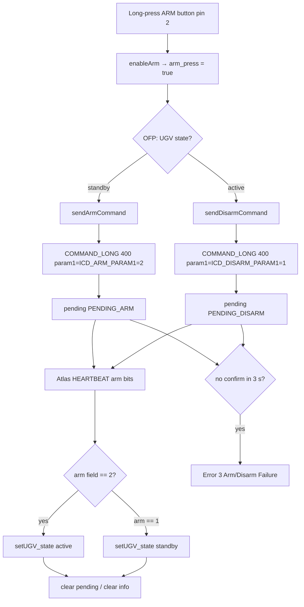

**Confirmation:** HEARTBEAT `custom_mode` arm field (`1` = standby/disarmed, `2` = active/armed) — see `receive_heartbeat()`.

---

### 7.4 Drive mode

**Purpose:** Cycle Scout drive mode (speed / torque / torque+speed-limit).

**Key files:** `IOhandler.cpp` (pin 7), `standard_procedures.cpp`, `packetHandler.cpp` (`sendModeChangeRequest`), `stateHandler.cpp`, `packet_receiver.cpp`

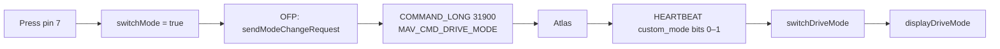

Pending timeout → TFT info: `"Drive mode request timed out"`.

---

### 7.5 Speed limit

**Purpose:** Cycle Low → Mid → High speed limit.

**Key files:** `IOhandler.cpp` (`cycleSpeedLimit`, pin 3 hold 3 s), `standard_procedures.cpp`, `packetHandler.cpp` (`sendSpeedChangeRequest`)

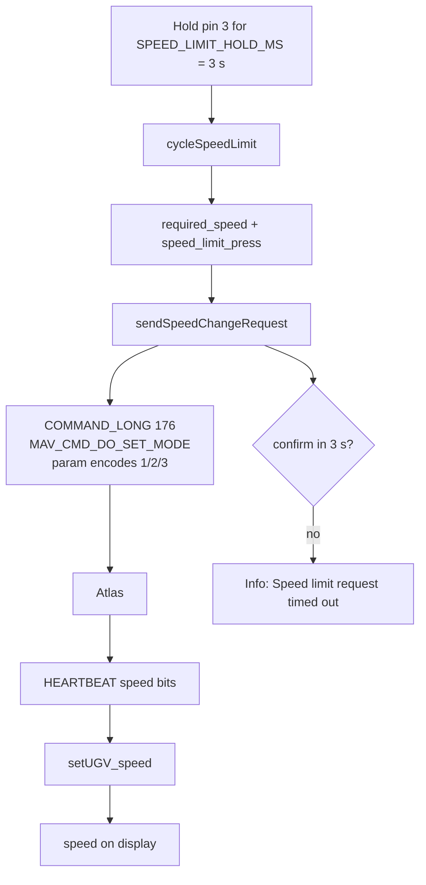

No auto-retry after timeout; next 3 s hold sends the next limit.

---

### 7.6 Lights

**Purpose:** Set head / fog / off from a 3-position toggle (edge-triggered — one TX per change).

**Key files:** `IOhandler.cpp` (`updateLightToggleEdge`, pins 6/8), `packetHandler.cpp` (`sendLightToggleState`), `message_structs.h`

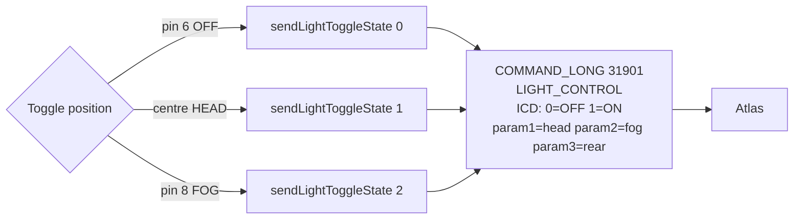

| Toggle pos | Encoding in `sendLightToggleState` |
|------------|-------------------------------------|
| 0 OFF | head=0, fog=0, rear=0 |
| 1 HEAD (centre) | head=1, fog=0, rear=1 |
| 2 FOG | head=0, fog=1, rear=0 |

---

### 7.7 Remote emergency stop

**Purpose:** Engage or clear vehicle remote e-stop; retransmit until HEARTBEAT confirms.

**Key files:** `IOhandler.cpp` (pins 4/5), `standard_procedures.cpp`, `packetHandler.cpp` (`sendEstopRequest`), `stateHandler.cpp` (`switchEmergencyMode`)

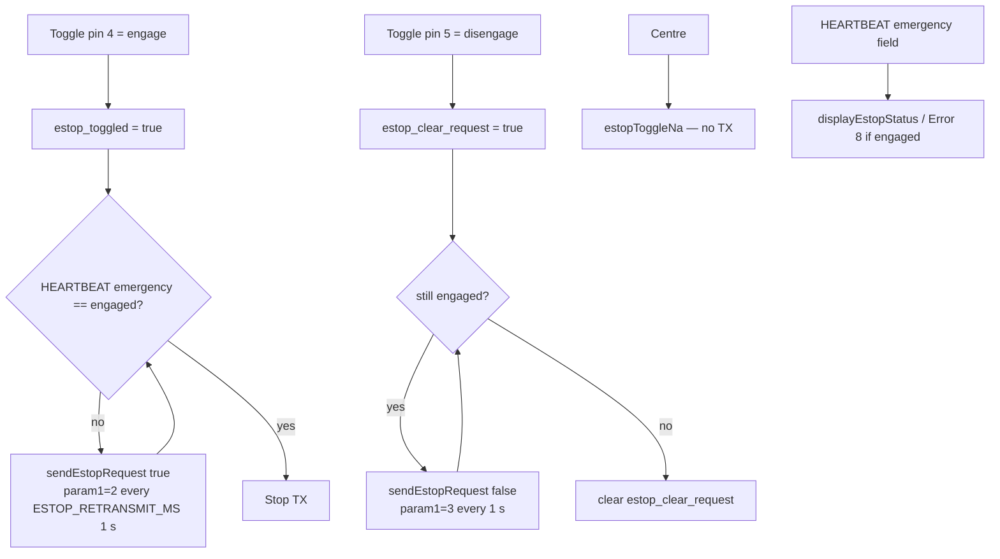

ICD param1 values (`definitions.h`): `1` Disable, `2` Engaged, `3` Disengaged. HC toggle uses 2 and 3.

---

### 7.8 Display / HMI updates

**Purpose:** Show operator status without blocking the OFP.

**Key files:** `displayHandler.cpp`, `display_defs.h`, `stateHandler.cpp`, `periodicActions` → `updateDisplay` every 2 s

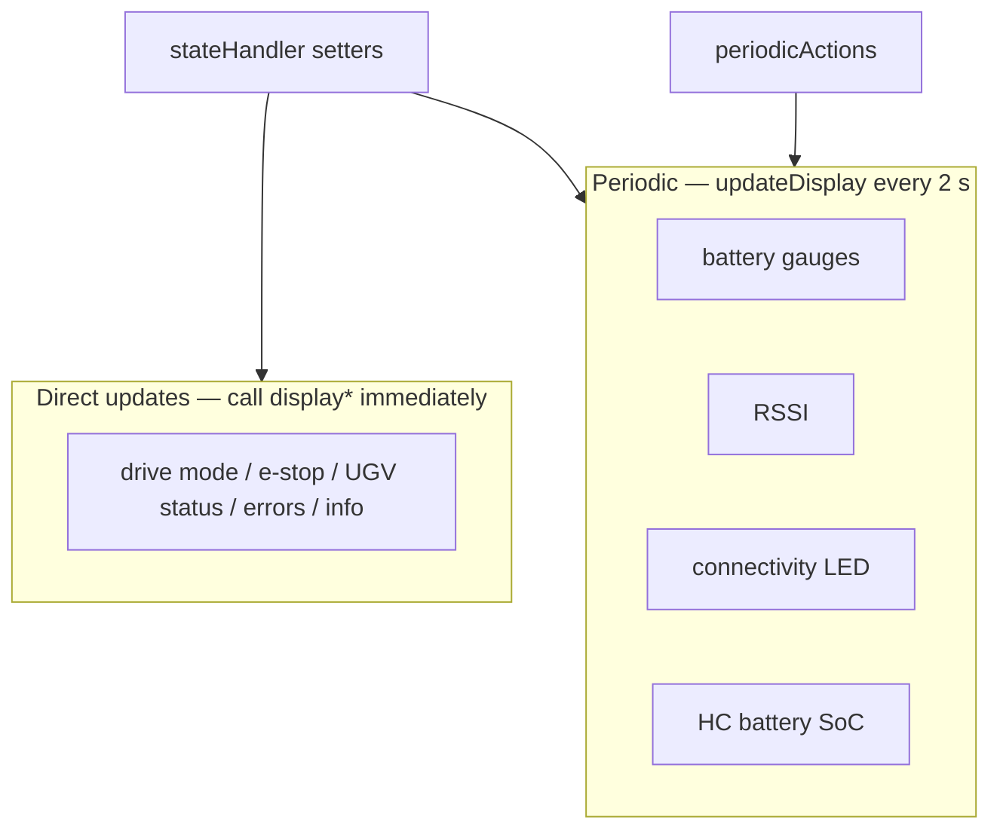

**HC battery:** ADC A6 → local UI only; **never** sent on MAVLink (`readHcBatterySoc` in `IOhandler.cpp`).

---

### 7.9 Radio AT-command configuration (maintenance mode)

**Purpose:** Configure the RFD radio from the Mega (not part of normal teleop).

**Key files:** `radio_config.cpp`, compile flag `GET_RADIO_CONFIG` in `definitions.h`

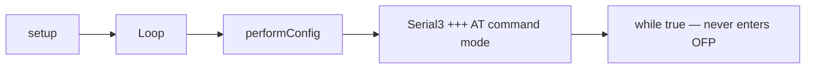

---

### 7.10 Packet TX/RX pipeline (shared by all features)

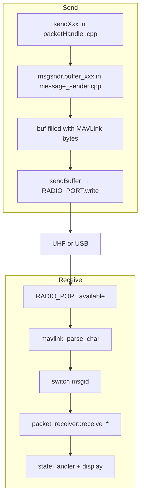

**RX messages handled today** (`handlePacketReceived`):

| msgid | Handler |
|-------|---------|
| TIMESYNC (111) | `receive_timesync` |
| RADIO_STATUS (109) | `receive_radio_status` |
| HEARTBEAT (0) | `receive_heartbeat` |
| SYS_STATUS / COMMAND_ACK | Only if `DEPRECATED_REV_1` is **not** defined (secondary paths) |

**Not wired yet:** `UGV_SYSTEM_INFO` (50001) exists in dialect XML but has no RX case.

---

### 7.11 HEARTBEAT `custom_mode` decode (Atlas → HC status bus)

Atlas packs status into HEARTBEAT `custom_mode`. HC unpacks in `receive_heartbeat()`:

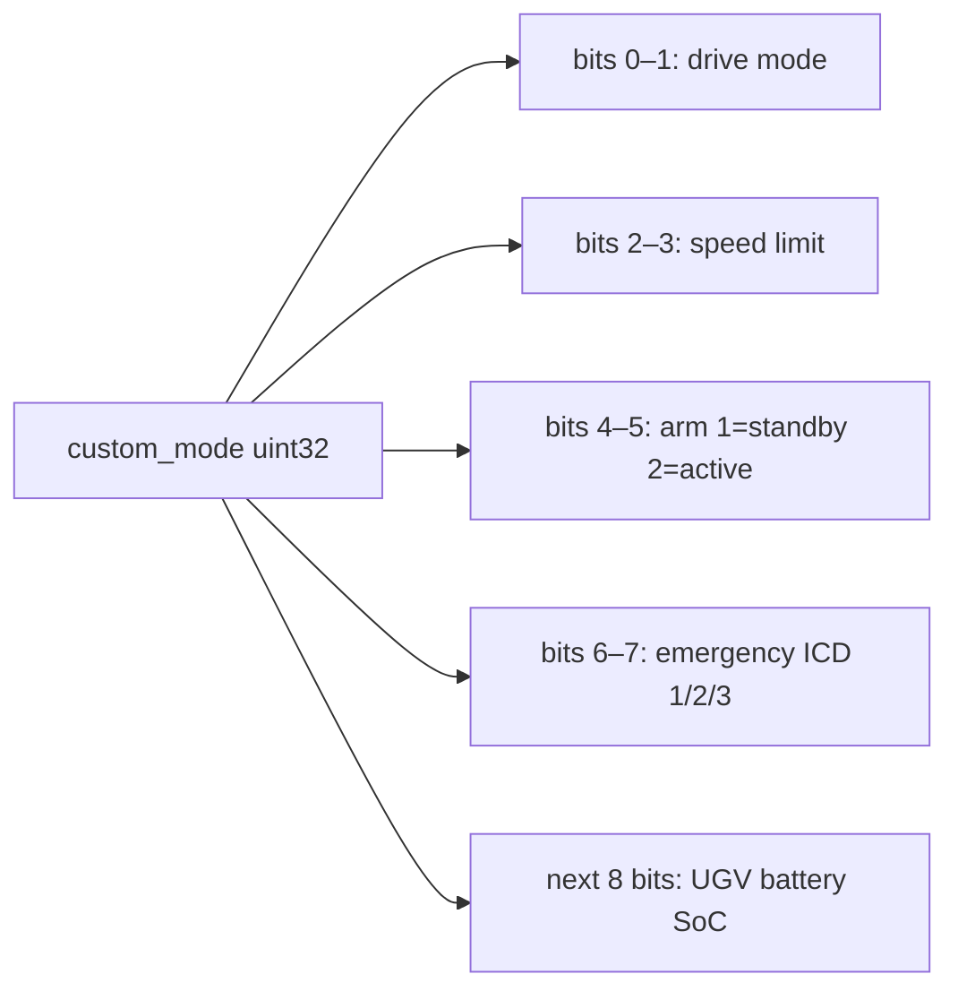

This is the **primary feedback channel** for arm, speed, drive mode, e-stop, and UGV battery.

---

## 8. MAVLink message catalog

**Dialect source:** `src/ugvcustom.xml` → generated headers under `include/custom_v0.3/`  
**IDs:** HC = system `2` / component `1`; Scout = `1`; Atlas component = `191`

| Direction | Message | ID / cmd | Sender / receiver in code |
|-----------|---------|----------|---------------------------|
| HC → Atlas | HEARTBEAT | 0 | `sendHeartbeat` / `buffer_heartbeat` |
| HC → Atlas | TIMESYNC | 111 | `sendTimesyncRequest` |
| HC → Atlas | MANUAL_CONTROL | 69 | `sendManualControl` |
| HC → Atlas | COMMAND_LONG ARM/DISARM | 76 / **400** | `sendArmCommand` / `sendDisarmCommand` |
| HC → Atlas | COMMAND_LONG DO_SET_MODE | 76 / **176** | `sendSpeedChangeRequest` |
| HC → Atlas | COMMAND_LONG DRIVE_MODE | 76 / **31900** | `sendModeChangeRequest` |
| HC → Atlas | COMMAND_LONG LIGHT_CONTROL | 76 / **31901** | `sendLightToggleState` |
| HC → Atlas | COMMAND_LONG REMOTE_EMERGENCY | 76 / **31904** | `sendEstopRequest` |
| Atlas → HC | HEARTBEAT | 0 | `receive_heartbeat` |
| Atlas → HC | TIMESYNC | 111 | `receive_timesync` |
| Radio → HC | RADIO_STATUS | 109 | `receive_radio_status` |

Optional signing: `SIGN_PACKETS` + `signing_key[]` in `definitions.h`; timesync seeds the signing clock.

---

## 9. Physical controls → pins → code

**Source of truth:** `IO_defs.h` + `IOhandler.cpp` (comments in `standard_procedures.cpp` match this map).

| Pin | Macro | Hardware | IO callback / flag | OFP / TX |
|-----|-------|----------|--------------------|----------|
| A0 | `XPIN` | Joystick X | `getXY` | `MANUAL_CONTROL` |
| A1 | `YPIN` | Joystick Y | `getXY` | `MANUAL_CONTROL` |
| 2 | `BUTTON_ARM` | Arm long-press | `enableArm` → `arm_press` | ARM/DISARM 400 |
| 3 | `BUTTON_SPEED_LIMIT` | Hold 3 s | `cycleSpeedLimit` → `speed_limit_press` | DO_SET_MODE 176 |
| 4 | `TOGGLE_ESTOP_ENGAGE` | E-stop engage | `engageEstop` | REMOTE_EMERGENCY param1=2 |
| 5 | `TOGGLE_ESTOP_DISENGAGE` | E-stop clear | `disengageEstop` | param1=3 |
| 6 | `TOGGLE_LIGHTS_OFF` | Lights OFF | `turnOffLights` | LIGHT_CONTROL |
| 7 | `BUTTON_TORQUE_MODE` | Drive mode | `enableSwitchMode` → `switchMode` | DRIVE_MODE 31900 |
| 8 | `TOGGLE_FOGLIGHTS` | Fog | `turnOnFoglights` | LIGHT_CONTROL |
| A6 | `HC_BATTERY_ADC_PIN` | HC pack sense | `readHcBatterySoc` | UI only |
| A2–A5, A7, A9 | TFT_* | ILI9225 | `displayHandler` | — |

> Older docs under `docs/HC_SRS_v1.4_TRACEABILITY.md` may show a different pin matrix. **Trust `IO_defs.h` for firmware behavior.**

---

## 10. Display / HMI

| Concern | File |
|---------|------|
| Draw APIs | `displayHandler.cpp` / `.hpp` |
| Colours, positions, layout | `definitions/display_defs.h` |
| When to refresh | Direct from `stateHandler`; periodic via `updateDisplay` (2 s) |
| Errors / info banners | `displayError`, `displayInfo`, `clearError`, `clearInfo` |
| Splash / static chrome | `setupDisplay`, `displayBasic` |

---

## 11. Configuration & compile modes

**Master file:** `src/single_hand_controller/include/definitions.h`

### Link mode (most common switch)

| Goal | `RELEASE` | `HC_LINK_OVER_USB` |
|------|-----------|--------------------|
| Production UHF | defined | undefined |
| Lab USB ↔ Atlas | undefined | defined |
| Radio + USB Serial Monitor debug | undefined | undefined (+ `_DEBUG_` ok) |

Details: `docs/HC_LINK_USB_VS_RADIO.md`

### Other useful defines

| Define | Effect |
|--------|--------|
| `SIGN_PACKETS` | Signed MAVLink |
| `MANUAL_CONTROL_ONLY_WHEN_MOVING` | Stick TX only when deflected (+ zero frame) |
| `GET_RADIO_CONFIG` | Boot into RFD AT config forever |
| `TESTING_JOYSTICK` | Dump stick forever |
| `TESTING` | Skip connectivity; jump toward OFP |
| `_DEBUG_` / `PRINT_BYTES` | Serial logging (do **not** use with USB MAVLink) |
| `STOP_COMM` / `STOP_RECV` | Mute TX or RX for IO bench testing |
| `ICD_ARM_PARAM1` / `ICD_DISARM_PARAM1` | 2 = arm, 1 = disarm |
| `ICD_REMOTE_EMERGENCY_*` | 1/2/3 e-stop params |

**Runtime config:** none. No `.env`, no EEPROM path in normal OFP. Everything is compile-time + RAM state.

---

## 12. Error codes

Defined in `definitions/error_codes.h`; operator meanings in `src/error_handling.md`.

| Code | Macro | Meaning |
|------|-------|---------|
| 1 | `SIGNING_FAIL` | Signing setup failed / disabled |
| 2 | `JOYSTICK_CALIBRATION` | Deprecated calibration path |
| 3 | `ARM_DISARM_FAIL` | Arm/disarm not confirmed in 3 s |
| 5 | `RADIO_COMM_FAILURE` | No local `RADIO_STATUS` (HC↔radio) |
| 6 | `RADIO_BUFFER_OVERLOAD` | Radio TX buffer nearly full |
| 7 | `TIME_SYNCHRONIZE_FAILED` | No timesync response from Scout |
| 8 | `ESTOP_ENGAGED` | E-stop engaged (informational) |

---

## 13. How to navigate the code as a newcomer

Use this path the first time you open the repo:

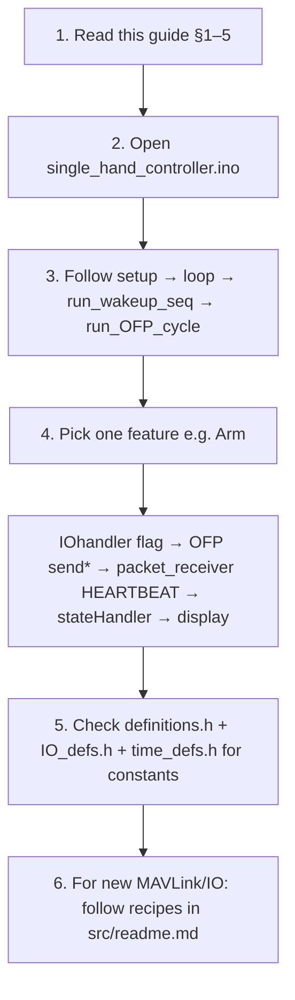

**Mental model cheat sheet:**

| Question | Look here first |
|----------|-----------------|
| When does the loop start teleop? | `single_hand_controller.ino` + `run_wakeup_seq` |
| What happens every 20 ms? | `run_OFP_cycle` |
| Which pin is this button? | `IO_defs.h` |
| Who sets the request flag? | `IOhandler.cpp` |
| Who sends the MAVLink? | `packetHandler.cpp` → `message_sender.cpp` |
| Who applies Scout feedback? | `packet_receiver.cpp` → `stateHandler.cpp` |
| Who draws the screen? | `displayHandler.cpp` |
| What does Error N mean? | `error_handling.md` |

---

## 14. Related docs

| Document | Use it for |
|----------|------------|
| Root `README.md` | Build / flash / verify on Windows & Linux |
| `src/readme.md` | How to add modes, display items, MAVLink, IO |
| `src/error_handling.md` | Operator-facing error resolution |
| `docs/HC_LINK_USB_VS_RADIO.md` | USB vs UHF switch |
| `docs/HC_SRS_v1.4_TRACEABILITY.md` | SRS Mode A requirement status (pin table may lag code) |
| `src/ugvcustom.xml` | MAVLink ICD dialect source |

---

## Appendix A — Timing constants (quick reference)

From `time_defs.h`:

| Constant | Value | Role |
|----------|-------|------|
| `OFP_LOOP_TIME` | 20 ms | Teleop loop period |
| `HEARTBEAT_TIMEOUT` | 3 s | Declare disconnect |
| `STATE_REQUEST_TIMEOUT_MS` | 3 s | Arm/speed/mode pending fail |
| `ESTOP_RETRANSMIT_MS` | 1 s | E-stop retransmit while waiting confirm |
| `SPEED_LIMIT_HOLD_MS` | 3 s | Hold before speed cycle |
| `LONG_PRESS_DURATION` | 500 ms | Arm button long-press |
| Display period | 2 s | `updateDisplay` via periodic actions |
| HC heartbeat period | 1 s | While connected / wakeup |

---

## Appendix B — End-to-end “day in the life” of a session

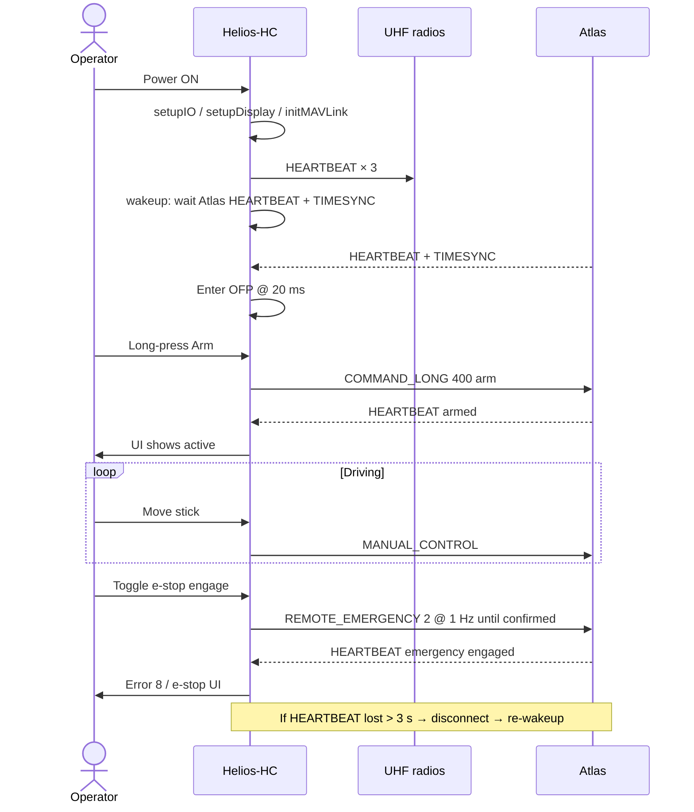

---

*This guide describes the Hand Controller firmware as implemented in-tree. Peer systems (Atlas, VCU, Mode B, GCS) are outside this repository except as MAVLink endpoints.*
