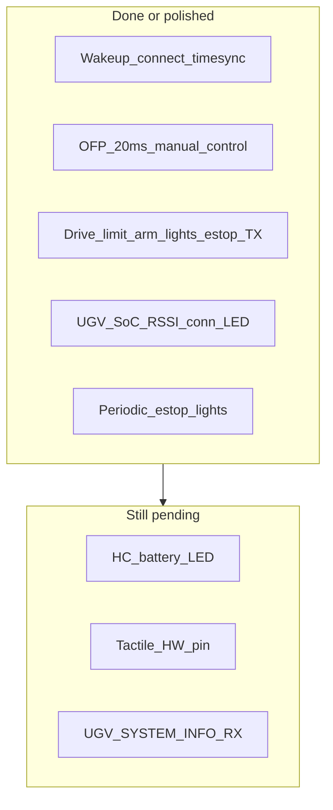

# Hand Controller — SRS v1.4 Traceability (Mode A / Helios)

**SRS:** `scout_td0_system_._software_requirement_specification_v1.4.pdf`  
**Firmware:** `src/single_hand_controller/`  
**Scope:** Mode A Hand Controller (Section 3). Atlas / VCU / OBD / GCS / Mode B are out of scope except where HC must TX/RX.  
**Author:** Abhishek  
**Updated:** 15 Jul 2026 — battery gauge fill/SoC fix; file header refresh; prior SRS polish (IO mapping frozen).

---

## High-level verdict

Core Mode A teleop path is present. Software gaps addressed in this pass:

- Connectivity LED priority semantics (§3.2.2)
- Periodic e-stop retransmit while engaged (§3.3.1)
- UGV battery colour bands + tactile hook (§3.2.4)
- Heartbeat-based arm/mode/limit fail visibility (no COMMAND_ACK in current dialect)
- Periodic light retransmit while ON (§3.2.9)
- 3 s state-request timeout for speed / drive mode / arm

Still pending / blocked on hardware: **HC own battery LED** (§3.2.3), **physical tactile actuator** (pin undefined), **`UGV_SYSTEM_INFO` RX** if Atlas starts sending 50001.

---

## Hardware constraint (authoritative)

Do **not** rework remote button/toggle UX. Physical remote:

| Control | Function |
|---------|----------|
| **Toggle 1** | Speed limit: **High / Mid / Low** |
| **Toggle 2** | **On / Off** (as wired on the unit) |
| **Toggle 3** | **E-stop / Disarm / Arm** (3-position) |
| **Press button 1** | **Headlight** |
| **Press button 2** | **Fog light** |
| **Top stick** | **Forward / Reverse / Left / Right** |

| Physical role | Code (`IO_defs.h` / `IOhandler.cpp`) |
|---------------|--------------------------------------|
| Speed HI / MID / LO | pins 4+5 → `tt_speed_toggle` |
| Headlight / Fog press | pins 3 / 2 |
| Arm / Disarm / E-stop | pins 6 / 8 |
| Drive mode cycle | pin 7 → `b_mode_switch` |
| Direction | A0 / A1 joystick |

SRS “3 s long-press arm” is **N/A (hardware)** — Toggle 3 remains.

---

## Traceability matrix

| SRS ID | Requirement (HC side) | Status | Notes |
|--------|----------------------|--------|-------|
| **3.1.1 / 3.1.2** | Send normalised X/Y | **Implemented** | `sendManualControl()` @ 20 ms when armed |
| **3.1.3** | Torque + speed limit | **Partial** | HC can select `torque_sl`; vehicle TBD in SRS |
| **3.2.1** | Power ON / connect / timesync / secure | **Implemented** | signing + wakeup seq |
| **3.2.2** | Connectivity LED colours + priorities | **Implemented** | UGV disconnected → **Red** (fixed field observation). Yellow only when connected with low RSSI. Blue = timesync. Green = healthy. |
| **3.2.3** | HC own battery LED | **Pending** | Needs ADC / LED HW |
| **3.2.4** | UGV battery bands + tactile | **Improved** | Bands match SRS; `triggerTactileAlert()` no-op until `TACTILE_PIN` defined |
| **3.2.5** | Set drive mode; show UGV mode | **Improved** | HB-driven display; 3 s pending timeout |
| **3.2.6** | Set Limit LO/MED/HI | **Improved** | 3 s resend / timeout; display from HB |
| **3.2.7** | Arm/Disarm | **Implemented** + **N/A (hardware)** | Toggle 3; fail via `ARM_DISARM_FAIL` on 3 s timeout |
| **3.2.8** | Joystick every 20 ms | **Implemented** | `OFP_LOOP_TIME` |
| **3.2.9** | Lights periodically | **Improved** | Cmd encoding **1=ON, 2=OFF** (ICD); press toggles unchanged; 1 Hz retransmit while ON |
| **3.3.1** | Remote e-stop periodic | **Improved** | Retransmit engage @ 1 Hz while Toggle 3 e-stop |
| **3.3.2** | UHF radio failure safe state | **N/A (HC)** | Atlas/VCU |
| **3.4.x** | Radio / IMU / obstacle | HW / N/A | — |

---

## Code touchpoints (this pass)

| Area | Files |
|------|--------|
| Conn LED | `displayHandler.cpp`, `enum_defs.h` |
| Battery / tactile | `displayHandler.cpp`, `IO_defs.h` |
| E-stop / lights / pending | `standard_procedures.cpp`, `time_defs.h` |
| Light retransmit API | `packetHandler.cpp` / `.h` |

---

## Remaining backlog

1. Wire `TACTILE_PIN` when haptic HW exists; call path already present.  
2. HC battery ADC + LED bands (§3.2.3).  
3. Parse `UGV_SYSTEM_INFO` (50001) if Atlas emits it.  
4. Production: compile CI, signing-key injection, AVR watchdog, remove unused `initiateController` or wire it into setup.

---

## Explicit non-goals

- Do **not** convert Arm/Disarm to long-press.  
- Do **not** remake Toggle 3 or light press buttons.  
- Do **not** remake Speed HI/MID/LO wiring.
